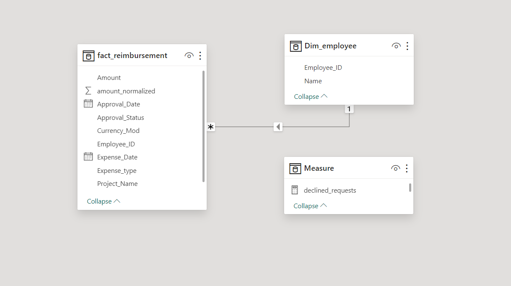

<p align="center">
  <h1 align="center">Movie Reimbursement Analysis</h1>

  <p align="center">
    Dive into analyzing box office data with Power BI! This project involves creating engaging visuals and extracting meaningful insights from the Employee_reimbursement_dataset.xlsx.
    <br/>
    <br/>
    <a href="https://github.com/Namratapatel9027/Movie-Reimbursement-Analysis"><strong>Explore the Project »</strong></a>
    <br/>
    <br/>
  </p>
</p>

## Table Of Contents

* [About the Project](#about-the-project)
* [Tasks](#tasks)
* [Results](#results)
* [Acknowledgements](#acknowledgements)
* [Built With](#built-with)
* [Contributing](#contributing)
* [License](#license)

## About The Project

<h1 align="center">Screenshots</h1>

<!-- Add screenshots of your Power BI visuals -->

<br>

## Tasks

1. **Data Import and Cleaning:**
   - Imported the data and utilized Power Query for data transformation.
   - Corrected spelling and punctuation errors in the expense type column.
   - Standardized project names for uniformity.
   - Created a custom column to handle missing values in the Currency column using the following formula:
     ```sh
     if [Currency] = null and [Amount] >= 1000 then "INR" 
     else if [Currency] = null and [Amount] < 1000 then "USD" 
     else [Currency]
     ```
   - Normalized the amount column to INR based on the currency.

2. **Creating Measures and Calculations:**
   - Created a measure to calculate the sum of reimbursed amounts in INR.
   - Used the CALCULATE function to determine the total reimbursed amount for Project_B.
   - Created a measure to count declined requests.

3. **Visualizations:**
   - Created a slicer visual for the Project and Employee.
   - Created a bar chart for Employees and Reimbursement Amount.
   - Created a pie chart for Project vs Reimbursement Amount.

## Results

- Successfully cleaned and prepared the dataset.
- Created meaningful measures to derive insights.
- Developed engaging visuals to represent the data effectively.

## Acknowledgements

Special thanks to [Codebasics](https://www.linkedin.com/company/codebasics), [Dhaval Patel](https://www.linkedin.com/in/dhavalcodebasics/), and [Hemanand Vedival](https://www.linkedin.com/in/hemanandvedival/) for their guidance and support.

## Built With

- **Tool:** Power BI

## Contributing

Contributions are welcome! If you find any bugs or have suggestions for new features, please open an issue or submit a pull request. For major changes, please open an issue first to discuss the proposed changes.

## License

This project is licensed under the MIT License - see the LICENSE file for details.

Thank you for exploring the Power BI Practice Exercise🚀.
