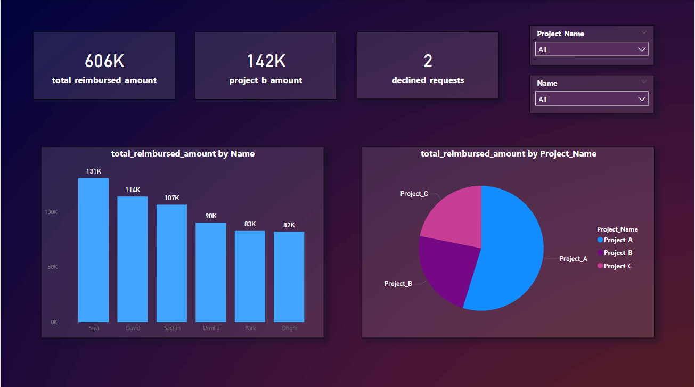

  <h1 align="center">Power BI Project: Movie Reimbursement Analysis
</h1>
This Power BI project analyzes movie reimbursement data to provide insights into spending patterns and trends.

### Data Sources
* Employee_reimbursement_dataset.xlsx

### About The Project
<h1 align="center">Screenshots</h1>

### Data Cleaning and Transformation
* Imported data using Power Query.
* Corrected spelling and punctuation errors in the expense type column.
* Standardized project names.
* Handled missing values in the Currency column using a custom formula.
* Normalized reimbursement amounts to Indian Rupees (INR).

### Measures
* **Total Reimbursed Amount (INR):** Calculates the sum of reimbursed amounts in INR.
* **Project B Reimbursed Amount:** Calculates the total reimbursed amount for Project_B.
* **Declined Requests:** Counts the number of declined reimbursement requests.

### Visualizations
* Bar chart showing employee reimbursement amounts.
* Pie chart illustrating reimbursement amounts across different projects.
* Slicers for filtering by Project and Employee.

### Tools Used
* Microsoft Power BI Desktop

### Acknowledgments
* Special thanks to Codebasics, Dhaval Patel, and Hemanand Vedival for their guidance and support.

Thank you for exploring the Power BI Practice Exercise🚀.

